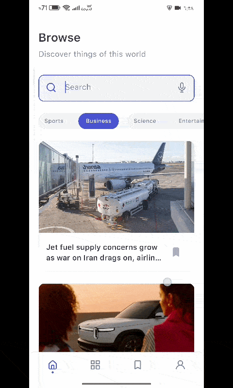
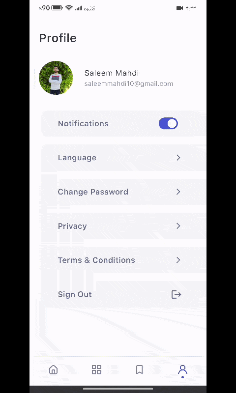
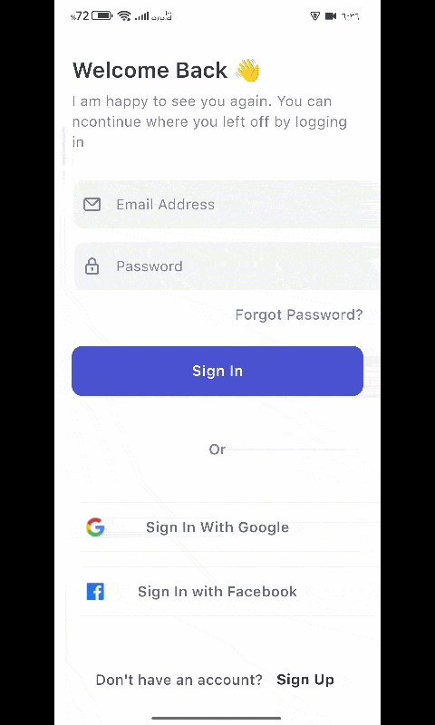

<h1 align="center">Nuntium — Clean Architecture News Client</h1>

<p align="center">
  
  
  
  
  
</p>

**Developer’s Note:** *This repository is a from-scratch reconstruction of a project I originally authored in 2023. After an involuntary two-year hiatus due to the conflict in Gaza, I rebuilt this system to rigorously re-solidify my mastery of Clean Architecture, functional error handling, and reactive state management. It is a deliberate exercise in professional discipline and technical resilience.*

## 📱 App Showcase

| Articles Infinite Scrolling | Bookmark Article |
| :---: | :---: |
|  |  |
| **Change Language** | **Google Sign In** |
|  |  |

## ✨ Key Features

- **Offline-First Bookmarks & Resilient Networking**: High-performance local caching for saved articles using Hive, combined with graceful error handling (OfflineFailure) when network connectivity drops.
- **Robust Authentication**: Secure flow utilizing Google Sign-In, Facebook Auth, and standard authentication models.
- **Multilingual Support (i18n)**: Instantly switch between languages using the `easy_localization` package.
- **Optimized Infinite Scrolling**: Paginated article feeds ensuring fast load times and reduced memory footprint.
- **Search Functionality**: Keyword-based article search powered by a dedicated `SearchNewsUseCase`, with paginated results routed through the repository layer.
- **Persistent Bookmarks**: Save articles locally with Hive for instant offline access, with reactive streams (`bookmarksStream`) that keep the UI in sync across screens.
- **Feature-First Clean Architecture**: Scalable, modular structure adhering to best practices and separation of concerns.

## 🛠 Tech Stack & Libraries

- **State Management & Routing**: `get` (GetX)
- **Local Storage & Caching**: `hive`, `hive_flutter`, `shared_preferences`
- **Networking & API**: `dio`, `internet_connection_checker`
- **Authentication**: `firebase_auth`, `google_sign_in`, `flutter_facebook_auth`
- **Dependency Injection**: `get_it`
- **UI & Animations**: `flutter_screenutil`, `shimmer`, `lottie`, `cached_network_image`, `carousel_slider`
- **Error Handling**: `dartz` — Used for functional error handling (`Either<Failure, Success>`) in the repository layer to ensure predictable state and eliminate unhandled exceptions.
- **Observability**: `firebase_crashlytics`, `pretty_dio_logger`, `logger`

## 🏗 Architecture Structure

The project strictly follows a **Feature-First Clean Architecture**, separating responsibilities logically. This ensures that the codebase remains scalable, testable, and maintainable.

```text
lib/
 ┣ core/              # Global utilities, theme, localization, network clients
 ┣ config/            # Dependency injection, router definitions
 ┣ features/
 ┃ ┣ auth/
 ┃ ┃ ┣ data/          # Models, API implementations, Local DB
 ┃ ┃ ┣ domain/        # Entities, Repositories (Interfaces), Use Cases
 ┃ ┃ ┗ presentation/  # Controllers (GetX), UI Screens, Widgets
 ┃ ┣ home/             # News feed, search, category filtering
 ┃ ┣ bookmarks/        # Hive-backed offline bookmark CRUD
 ┃ ┣ categories/
 ┃ ┣ profile/
 ┃ ┗ language/         # i18n runtime switching
 ```

## ⚙️ Automated CI/CD (GitHub Actions)

This project features a robust, automated continuous integration pipeline using GitHub Actions.

- **APK Generation**: Automatically builds a performant, 64-bit (arm64-v8a) `app-release.apk` whenever the `pubspec.yaml` version changes.
- **GitHub Releases**: Automatically extracts the version tag from `pubspec.yaml` and drafts a new GitHub Release with the compiled APK attached.
- **Secure Injection**: Safely manages and injects environment variables and Firebase configurations (`google-services.json`) via GitHub Secrets.

## 🚀 Getting Started

1. **Clone the repository:**
   ```bash
   git clone https://github.com/saleem-15/nuntium.git
   cd nuntium
   ```

2. **Install Dependencies:**
   ```bash
   flutter pub get
   ```

3. **Setup Environment Variables:**
   - Create a `.env` file in the root directory based on `.env.example` (if applicable) and define your API keys.

4. **Run the App:**
   ```bash
   flutter run
   ```

## 📫 Let's Connect!

I am actively open to new **Flutter Mobile Development** roles. Feel free to reach out if you'd like to discuss how I can add value to your team.

- **LinkedIn**: [Saleem Mahdi](https://www.linkedin.com/in/saleem-mahdi)
- **Email**: [saleemmahdi10@gmail.com](mailto:saleemmahdi10@gmail.com)
